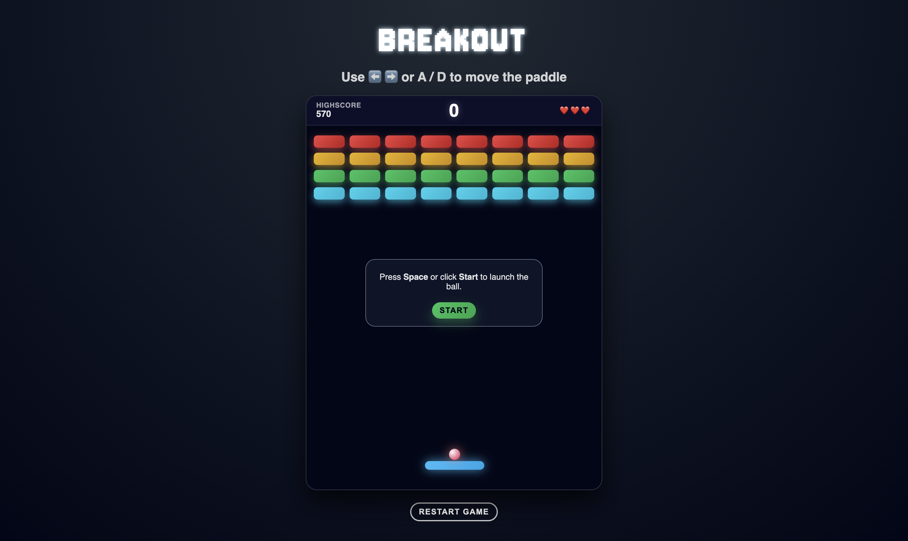

# 💥 Breakout: Remastered

The challenge was to recreate the classic Breakout arcade experience with clean visuals, responsive controls, sound effects, and additional gameplay mechanics — all using vanilla JavaScript, CSS and HTML (no Canvas or libraries).

## 🛠️ Tech Stack

- JavaScript
- HTML
- CSS

## ✨ Features

- Responsive paddle control (keyboard + mouse)
- Realistic ball physics with angled paddle bounces
- Power-ups: **Big Paddle, Multi-Ball, Extra Life**
- Game states: Start, Pause, Life Lost, Game Over, Win
- Local high score saving (LocalStorage)
- Background music, sound effects
- Fully DOM-rendered (no Canvas)

## ⚡️ Power-Ups

- **Big Paddle**: Temporarily increases paddle size
- **Multi-Ball**: Splits into 3 balls
- **Extra Life**: +1 life (up to a cap of 5)

## 🚧 Challenges

**1. Accurate Brick & Paddle Collision**  
Collision math was tricky because Breakout relies on which side of an object is hit.  
I solved this using overlap calculations and bouncing the ball using the smallest overlap value.

**2. Handling Multi-Ball & Falling Power-Ups**  
Removing items mid-update caused skipped elements.
I solved it with reverse iteration, proper DOM cleanup, and clean object lifecycle management.

**3. Designing a Clean Game State Machine**  
Spacebar and Start clicks behaved inconsistently until I centralized everything into a small finite state machine, simplifying the entire game flow.

## 📚 What I Learned

- Structuring code early reduces refactoring
- Implementing collision detection and bounce physics
- Managing full game flow with a simple state machine

## 🚀 Future Improvements

- Additional Levels
- Endless Mode
- Timer with score bonus
- More power ups
- Mobile Support
- Music & SFX Menu toggle

## 🖥️ Run Locally

1. Clone or download this repository
2. Open `index.html` directly in a modern browser

## 🕹️ How to Play

- Press `Space` or click **Start** to launch the ball.
- Break all bricks to win
- Lose a life when all balls drop below the paddle
- Catch falling power-ups to activate bonuses
- Bonus score for remaining lives at the end

## 🎮 Controls

- `< / >` or `A / D`: Move paddle
- `Spacebar`: Start / Pause / Resume
- **Mouse move**: Track paddle

### Cheats

- `9`: Quick restart
- `0`: Clear all bricks
- `8`: Clears High Score

## 📁 Project Structure

- `index.html` – markup and audio elements
- `style.css` – layout, animations, and effects
- `app.js` – game logic, state machine, controls, collisions, power-ups
- `sounds/` – background music and sound effects
